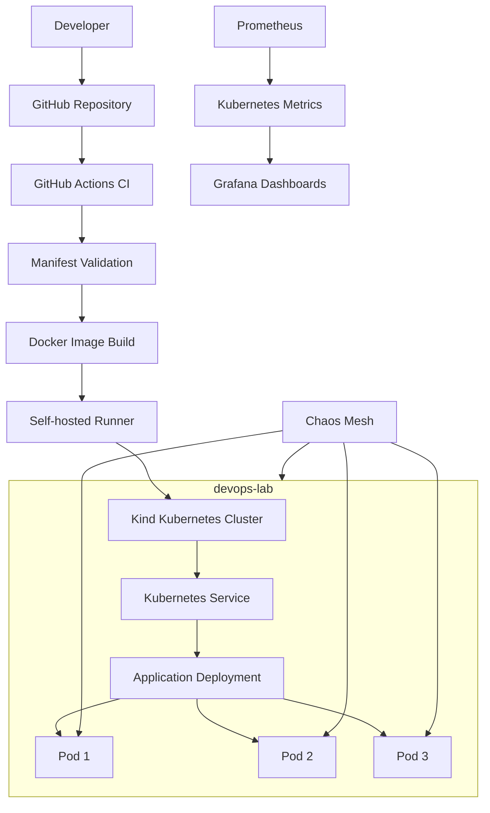

# Self-Healing Kubernetes Cluster with Chaos Testing

A hands-on DevOps project demonstrating Kubernetes self-healing, controlled fault injection, monitoring, recovery optimization, and automated CI/CD deployment using Kind, Chaos Mesh, Prometheus, Grafana, Docker, and GitHub Actions.

## Overview

This project deploys a containerized Nginx application to a multi-node local Kubernetes cluster and tests how the system responds to failures.

The project includes:

- A three-replica Kubernetes Deployment.
- Liveness and readiness probes.
- Resource requests and limits.
- Pod distribution constraints and node-failure tolerations.
- Chaos experiments for application, node, network, and container failures.
- Prometheus metrics and Grafana dashboards.
- A GitHub Actions pipeline for validation, image building, deployment, and health verification.
- Recorded recovery measurements for evaluating the behavior of the system.

## Architecture



### Technology stack

| Component | Technology |
|---|---|
| Containerization | Docker |
| Kubernetes environment | Kind |
| Application | Nginx |
| Orchestration | Kubernetes |
| Chaos engineering | Chaos Mesh |
| Metrics collection | Prometheus |
| Visualization | Grafana |
| CI/CD | GitHub Actions |
| Local deployment runner | GitHub Actions self-hosted runner |
| Manifest validation | Kubeconform |

## Project structure

```text
self-healing-k8s/
├── app/
│   ├── Dockerfile
│   ├── index.html
│   └── health
├── chaos/
│   ├── app-health-failure.sh
│   ├── network-loss.yaml
│   ├── network-traffic-test.sh
│   ├── pod-failure.sh
│   ├── pod-failure.yaml
│   ├── run-node-failure.sh
│   └── run-pod-failure.sh
├── k8s/
│   ├── namespace.yaml
│   ├── deployment.yaml
│   └── service.yaml
├── monitoring/
│   └── grafana-values.yaml
├── .github/
│   └── workflows/
│       └── ci.yml
├── kind-config.yaml
└── README.md
```

Experiment results are generated under `chaos/results/` and are currently excluded from Git by `.gitignore`.

## Kubernetes design

The application is deployed in the `self-healing` namespace.

### Deployment configuration

The Deployment uses three replicas and includes:

- **Readiness probe:** checks `/health` to determine whether a Pod can receive traffic.
- **Liveness probe:** checks `/health` to detect an unhealthy container and trigger a restart.
- **Resource requests:** 50 millicores of CPU and 64 MiB of memory per container.
- **Resource limits:** 200 millicores of CPU and 128 MiB of memory per container.
- **Topology spread constraints:** encourage distribution across nodes.
- **Node-failure tolerations:** 60-second tolerations for `not-ready` and `unreachable` node conditions.

The toleration settings were adjusted during the recovery-optimization phase to reduce the delay before Kubernetes can replace Pods affected by node failures.

## Monitoring

Prometheus collects Kubernetes metrics, and Grafana visualizes the state of the cluster and application.

The dashboard includes:

- Available versus desired application replicas.
- Total application container restarts.
- Ready Kubernetes nodes.
- Ready application Pods.

Example Prometheus queries:

**Available replicas**

```promql
kube_deployment_status_replicas_available{
  namespace="self-healing",
  deployment="self-healing-app"
}
```

**Desired replicas**

```promql
kube_deployment_spec_replicas{
  namespace="self-healing",
  deployment="self-healing-app"
}
```

**Application container restarts**

```promql
sum(
  kube_pod_container_status_restarts_total{
    namespace="self-healing",
    pod=~"self-healing-app-.*"
  }
)
```

**Ready Kubernetes nodes**

```promql
sum(
  kube_node_status_condition{
    condition="Ready",
    status="true"
  }
)
```

A healthy cluster in the tested configuration has three available application replicas and three Ready nodes.

## Chaos engineering experiments

The experiments introduce controlled failures to evaluate Kubernetes recovery behavior.

| Experiment | Mechanism | Recorded result |
|---|---|---|
| Pod failure | Pod failure and replacement | Experiment recorded in CSV results |
| Node failure | Node failure and recovery measurement | Optimized run: 115 seconds until the replacement Pod was Ready |
| Application health failure | Make the `/health` endpoint fail | Recovery measured at 36 seconds |
| Network packet loss | Chaos Mesh `NetworkChaos`, 50% packet loss for 60 seconds | 138 HTTP 200 responses and zero recorded HTTP failures |
| Container/process failure | Send `SIGTERM` to the container's main process | Pod Ready condition observed after 11 seconds |

### Recovery optimization

The node-failure experiment was measured before and after changing the node-failure tolerations.

| Measurement | Before optimization | After optimization |
|---|---:|---:|
| Failure detection | 52 seconds | 49 seconds |
| Pod creation | 352 seconds | 109 seconds |
| Replacement Pod Ready | 359 seconds | 115 seconds |
| Ready after Pod creation | 7 seconds | 6 seconds |

The observed time until the replacement Pod was Ready decreased from 359 seconds to 115 seconds, a reduction of approximately 68%.

These measurements describe the recorded runs and should not be interpreted as a guarantee of identical recovery times under every failure scenario.

### Network experiment interpretation

Chaos Mesh reported successful fault injection and recovery for the configured source and target Pods. During the recorded traffic window, 138 requests returned HTTP 200.

The measured average response time was approximately 1.044 milliseconds, with a maximum of 2.094 milliseconds.

The traffic CSV does not label requests by baseline, injection, and recovery phase. Therefore, these measurements establish successful HTTP responses during the observation window but do not establish the latency impact of packet loss specifically during injection.

## CI/CD pipeline

The GitHub Actions workflow is stored in `.github/workflows/ci.yml`.

### Pipeline stages

1. **Trigger:** a push to `main` or a pull request targeting `main`.
2. **Validation:** check required project files and validate Kubernetes manifests with Kubeconform.
3. **Image build:** build the application image on the GitHub-hosted runner.
4. **Deployment trigger:** after validation succeeds, a push to `main` can start the deployment job.
5. **Local image build:** the self-hosted runner builds a versioned image tagged with the Git commit SHA.
6. **Kind image loading:** the image is loaded into the local Kind cluster.
7. **Deployment update:** Kubernetes manifests are applied with the versioned image.
8. **Rollout verification:** wait for the Deployment to become available.
9. **Health check:** send an HTTP request to the application health endpoint.

The pipeline was successfully executed in a recorded run with a total duration of 51 seconds.

### Why use a self-hosted runner?

GitHub-hosted runners cannot directly access a Kind cluster running on a developer's laptop. The self-hosted runner allows the deployment job to use the local Docker daemon, Kind cluster, and Kubernetes configuration without exposing the Kubernetes API publicly.

A self-hosted runner is security-sensitive because jobs can access the machine on which it runs. Restrict deployment to trusted changes, review workflow modifications, and never execute untrusted pull-request code on a runner with access to the cluster.

## Prerequisites

- Ubuntu Linux.
- Docker Engine.
- Kind.
- `kubectl`.
- Git.
- Helm.
- A GitHub repository.
- A running Kind cluster named `devops-lab`.

Chaos Mesh and the Prometheus/Grafana monitoring stack are required to reproduce the corresponding experiments and dashboards.

## Setup and deployment

### 1. Clone the repository

```bash
git clone https://github.com/MakniAmin/self-healing-k8s.git
cd self-healing-k8s
```

### 2. Create the Kind cluster

If the cluster does not already exist:

```bash
kind create cluster \
  --name devops-lab \
  --config kind-config.yaml
```

Verify the context and nodes:

```bash
kubectl config current-context
kubectl get nodes
```

### 3. Build and load the application image

```bash
docker build -t self-healing-app:v2 ./app

kind load docker-image self-healing-app:v2 \
  --name devops-lab
```

### 4. Apply the Kubernetes manifests

```bash
kubectl apply -f k8s/namespace.yaml
kubectl apply -f k8s/service.yaml
kubectl apply -f k8s/deployment.yaml
```

Wait for the Deployment:

```bash
kubectl rollout status deployment/self-healing-app \
  -n self-healing --timeout=180s
```

Verify its state:

```bash
kubectl get deployment self-healing-app -n self-healing
kubectl get pods -n self-healing
kubectl get endpoints self-healing-service -n self-healing
```

### 5. Verify application health

Create a temporary test Pod:

```bash
kubectl run network-test \
  -n self-healing \
  --image=curlimages/curl:8.12.1 \
  --restart=Never \
  --command -- sleep 3600
```

Wait for it to become Ready and test the service:

```bash
kubectl wait --for=condition=Ready \
  pod/network-test -n self-healing --timeout=60s

kubectl exec -n self-healing network-test -- \
  curl -sS -o /dev/null \
  -w 'HTTP %{http_code}\n' \
  http://self-healing-service/health
```

The expected response is `HTTP 200`.

Delete the temporary Pod when finished:

```bash
kubectl delete pod network-test -n self-healing
```

## Reproducing CI/CD

Configure a GitHub Actions self-hosted runner on the Ubuntu machine that hosts the Kind cluster. Follow GitHub's repository-specific runner setup instructions and keep the runner registration token private.

The deployment workflow expects the runner to have access to:

- Docker.
- `kubectl` configured for `kind-devops-lab`.
- Kind.
- The project repository.

Push a trusted change to `main` and inspect the workflow under the repository's Actions tab.

## Troubleshooting

### Pods are not Ready

```bash
kubectl get pods -n self-healing
kubectl describe pods -n self-healing
kubectl get events -n self-healing --sort-by=.lastTimestamp
```

Check probe failures, image availability, resource constraints, and container logs.

### The image cannot be found in Kind

Load the image into the correct cluster and verify the Deployment's image tag:

```bash
kind load docker-image self-healing-app:v2 \
  --name devops-lab

kubectl describe deployment self-healing-app \
  -n self-healing
```

### The deployment runner cannot access Kubernetes

```bash
kubectl config current-context
kubectl get nodes
kind get clusters
```

The deployment runner must use the correct local context and have permission to access the cluster.

### A chaos experiment fails

Inspect the Chaos Mesh resource, its selectors, the selected Pods, and the recovery conditions before interpreting the results as a successful experiment.

## Project status

- [x] Multi-node Kind cluster.
- [x] Three-replica Kubernetes application.
- [x] Readiness and liveness probes.
- [x] Node-failure recovery optimization.
- [x] Application health-failure experiment.
- [x] Network packet-loss experiment.
- [x] Container/process failure experiment.
- [x] Prometheus and Grafana monitoring.
- [x] GitHub Actions validation and image build.
- [x] Automated deployment to local Kind.
- [x] Deployment rollout and HTTP health verification.
- [ ] Final screenshots and architecture documentation review.
- [ ] Select and publish sanitized experiment evidence.

## Future improvements

- Add phase-labeled traffic measurements to separate baseline, fault-injection, and recovery behavior.
- Export chaos events alongside Prometheus metrics for easier correlation in Grafana.
- Add automated testing of application behavior and manifest policy checks.
- Improve CI action-version maintenance and security hardening.
- Publish sanitized experimental CSVs and dashboard screenshots.

## Author

**Amin Makni**

GitHub: https://github.com/MakniAmin
